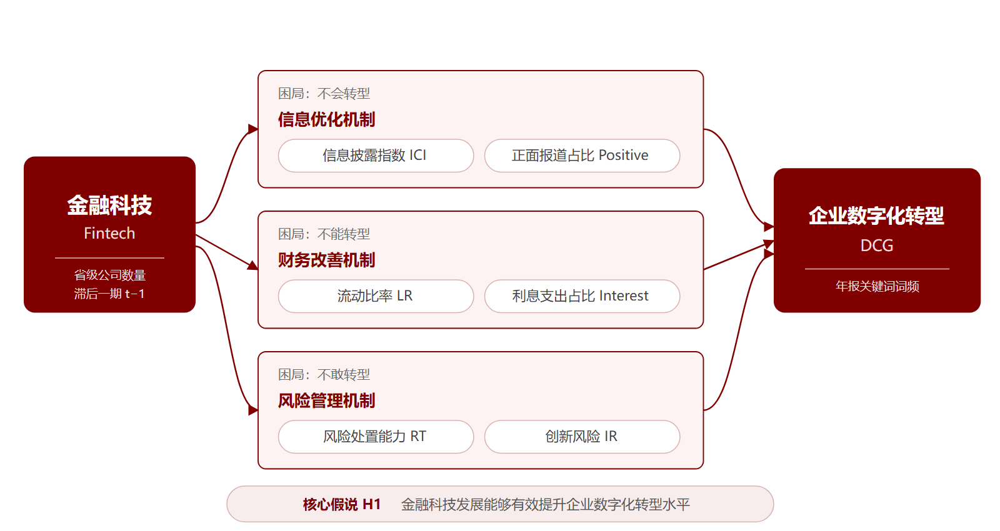
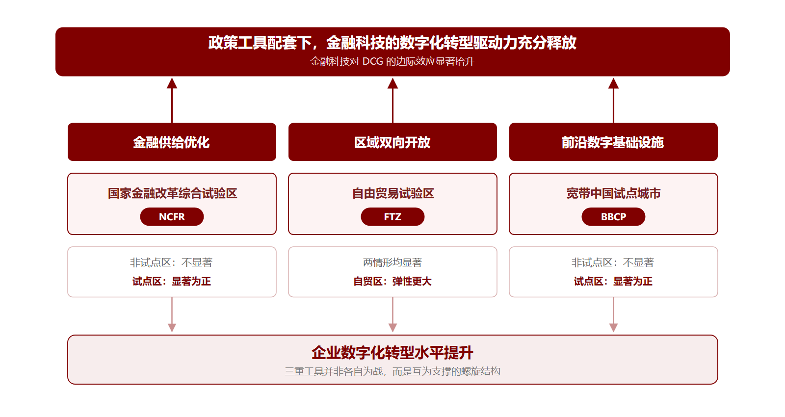

<!-- _class: lead -->
<!-- _paginate: false -->
<!-- _header: '' -->

# 金融科技与企业数字化转型

## ——结构特征、渠道机制与三螺旋体系下的政策优化研究

胡妍　向海凌　吴非

华南师范大学学报（社会科学版）2025 年第 6 期

汇报人：____　｜　2026-09-12

---

# 汇报框架

| 板块 | 内容 |
|------|------|
| **一** | 问题提出 |
| **二** | 理论逻辑与研究假说 |
| **三** | 研究设计 |
| **四** | 实证结果与解释 |
| **五** | 机制识别 |
| **六** | 三螺旋政策支持体系 |

> 全文围绕“金融科技—企业数字化转型”这一范式展开

---

# 一、问题提出：数字化转型的现实困境

**转型阵痛期在延展**

埃森哲指数显示，2018—2022 年企业数字化转型水平得分**五年来首次下降**

**传统金融存在结构性错位**

- 银行风控偏审慎，强化抵押品要求，形成嫌贫爱富的授信模式
- 资本市场覆盖面与供给规模有边界，压制成千上万主体的转型活力

> Hicks：工业革命不得不等候金融革命

---

# 本文的三点边际贡献

**① 内容分析框架拓展**

从本地金融科技影响外地企业的单一范式，转向**地域—全国渐进式地理视角**

**② 机制分析框架革新**

信息、财务、风险三维重构，风险维度细分**一般性风险与创新性风险**

**③ 政策工具配套突破**

不局限于政府监管、市场化环境等单一变量，构建**金融—开放—技术三螺旋框架**

---

# 二、理论逻辑：三大困局如何破解

| 困局 | 成因 | 金融科技的破解逻辑 |
|------|------|--------------------|
| **不会转型** | 转型能力欠缺，难以判断技术嵌合度 | 处理“结构化—非结构化”数据，降低信息阻隔 |
| **不能转型** | 转型成本高，资源边界约束紧 | 打通闲散资源流通渠道，降低融资成本 |
| **不敢转型** | 阵痛期长，不确定性与长周期 | 平滑创新风险，提升风险处置能力 |

> 金融科技的补位，本质是用数字技术解决传统金融的信息与配置难题

---

# 核心假说 H1

<div style="border: 2px solid #800000; border-radius: 12px; background: #FDF3F3; padding: 26px 30px; margin: 18px 0 30px 0; font-size: 33px; font-weight: 700; color: #800000; line-height: 1.5; text-align: center;">

在保持其他因素不变的条件下，金融科技发展能够有效提升企业数字化转型水平

</div>

**待检验的关键问题**

- 这一正向效应在计量上是否成立、有多强
- 若成立，通过哪些渠道传导
- 什么样的制度配套能让它释放更大效能

---

# 架构图一：理论机制总框架



---

# 机制一：信息优化机制（破解不会转型）

**内部：提升数据处理能力**

- 增强数据抓取、清洗、运算能力，盘活企业自有的财务、生产、市场数据
- 开源技术缩短了数字信息处理技术在企业间的扩散路径

**外部：改善市场积极预期**

- 公开透明展示财务状况、交易历史与运营流程，提升外部信任度
- 积极预期带来更强的创新意愿与更高的风险容忍空间

> 机制变量：信息披露指数 ICI、正面报道占比 Positive

---

# 机制二：财务改善机制（破解不能转型）

**提升偿债能力**

- 借助大数据、云计算、AI 实时监控与预测资金流动
- 自动化资金调度，提高资金使用效率，保证偿债现金流充足

**降低融资成本**

- 机器学习算法赋能金融机构建立授信评估模型，清除融资渠道的技术障碍
- 压低企业在融资市场承担的风险溢价，融资选择更多元

> 机制变量：流动比率 LR、利息支出占总负债比重 Interest

---

# 机制三：风险管理机制（破解不敢转型）

**提升风险处置能力**

- 实时监控市场变化、行业动向与内部运营
- 快速识别市场波动、供应链中断、财务异常等风险源

**抑制创新风险**

- 捕捉前沿技术演进轨迹，强化专项性研发支出
- 平滑研发过程中的风险，提高研发投入产出绩效

> 机制变量：风险处置能力 RT、创新风险 IR

---

# 三、研究设计：样本与数据清洗

**样本范围与数据来源**

- 沪深两市 A 股主板上市公司，2011—2021 年，回归样本 **17 178** 个企业—年度观测值
- 微观数据来自 CSMAR 数据库与巨潮资讯网，宏观数据来自国家统计局

**四条清洗规则**

1. 仅保留核心数据连续 5 年以上无缺失的观测值
2. 剔除银行、证券、保险、房地产等金融类企业
3. 剔除研究期内的 ST 类、退市和 IPO 企业
4. 连续型变量做 1%、99% 缩尾处理

---

# 变量设定：核心变量与控制变量

| 角色 | 变量 | 测度方式 |
|------|------|----------|
| 被解释变量 | **DCG** | 年报“数字化转型”关键词词频，滚动平均后对数化 |
| 核心解释变量 | **Fintech** | 区域内注册且经营范围含金融科技业务的公司数目，构成“省份—年度”面板，取滞后一期 |
| 控制变量（微观） | Asset / Lev / Conce | 总资产对数、总负债÷总资产、第一大股东持股占比 |
| 控制变量（微观） | Age / Turnover / Dual | 成立年限、日均换手率、两职合一 |
| 控制变量（微观） | Audit / Allocation / Roe / QFII | 审计意见、实体资产配置、净资产收益率、QFII 持股 |
| 控制变量（宏观） | GDP / Struc23 / Digital_economy | 地区 GDP 对数、二产÷三产、地区数字经济水平 |

> DCG 采用滚动算法：本年度词频取本年度及前后 1 年词频的算术平均数，降低年报披露的异常偏差

---

# 公式推导一：基准双向固定效应模型

**第一步：一般面板回归形式**

$$ y_{it} = \alpha + \beta x_{it} + \gamma' Z_{it} + u_i + \lambda_t + \varepsilon_{it} $$

**第二步：代入本文设定，得到方程（1）**

$$ DCG_{i,j,t} = \varphi_0 + \varphi_1 Fintech_{i,t-1} + \sum \varphi CVs + \sum \lambda Year + \sum \mu Firm + \varepsilon_{i,j,t} $$

| 项 | 含义 | 为什么这么设 |
|----|------|--------------|
| $\varphi_1$ | 核心待估系数 | Fintech 每增加 1 单位，log(DCG) 变动 $\varphi_1$，约合 DCG 变动 $\varphi_1 \times 100\%$ |
| $t-1$ | 解释变量滞后一期 | 缓解转型好的企业更吸引金融科技的反向因果 |
| $Year$ | 时间固定效应 | 吸收宏观经济周期等共同时间冲击 |
| $Firm$ | 企业固定效应 | 吸收企业固有、不随时间变化的异质性 |

---

# 公式推导二：溢出协同与边际效应

**引入外省金融科技强度，构造交互项，得到方程（2）**

$$ DCG_{i,j,t} = \varphi_0 + \varphi_1 Fintech_{i,t-1} + \varphi_2 \left( Fintech_{i,t-1} \times FintechPeer_{i,t-1} \right) + \varphi_3 FintechPeer_{i,t-1} + \sum \varphi CVs + \sum \lambda Year + \sum \mu Firm + \varepsilon_{i,j,t} $$

**对方程（2）就本地金融科技求偏导，得边际效应**

$$ \frac{\partial\, DCG_{i,j,t}}{\partial\, Fintech_{i,t-1}} = \varphi_1 + \varphi_2 \cdot FintechPeer_{i,t-1} $$

- 边际效应**不再是常数**，而是随外省金融科技强度变化的一条直线
- 若 $\varphi_2 > 0$：外省金融科技越强，本地金融科技对企业数字化转型的边际驱动力越大
- 这正是溢出协同而非相互拮抗的计量表达

> 两个口径：同地区（东中西部）其他省份 Fintech_Peer_S、全国其他省份 Fintech_Peer_O

---

# 代码示例一：用 Python 构建 DCG 指标

```python
import jieba, numpy as np, pandas as pd

# 演示用精简词典；论文实际采用吴非等（2021）的完整数字化转型词库
KEYWORDS = ["人工智能", "区块链", "云计算", "大数据",
            "数字化转型", "智能制造", "物联网", "工业互联网"]

def count_freq(text: str) -> int:
    """统计单份年报中数字化转型关键词的总词频"""
    return sum(w in KEYWORDS for w in jieba.lcut(text))

raw = pd.read_csv("annual_reports.csv")        # 列：firm, year, text
raw = raw.drop_duplicates(["firm", "year"])    # 防止 pivot 报错
raw["freq"] = raw["text"].map(count_freq)

# 滚动算法：本年 + 前后各 1 年取算术平均，再做对数化
panel = raw.pivot(index="firm", columns="year", values="freq")
# 注意 axis=1：年份在列方向，必须按年份平移，否则会错位成"前后一家企业"
roll  = (panel.shift(1, axis=1) + panel + panel.shift(-1, axis=1)) / 3
DCG   = np.log1p(roll.stack()).rename("DCG").reset_index()
```

> 论文第 187 页：词频对数化并采用滚动算法，降低年报文本披露的异常偏差；首尾年份因缺前后一年会被丢弃

---

# 代码示例二：复现双向固定效应回归

```python
import pandas as pd
from linearmodels.panel import PanelOLS

df = pd.read_csv("panel.csv")                  # firm, year, DCG, Fintech, 控制变量
df = df.sort_values(["firm", "year"])          # 必须先排序，否则 shift 取到上一行而非上一年
df["Fintech_L1"] = df.groupby("firm")["Fintech"].shift(1)   # 滞后一期
df = df.set_index(["firm", "year"])

# 双向固定效应：entity_effects 控制企业，time_effects 控制年份
model = PanelOLS.from_formula(
    "DCG ~ Fintech_L1 + Asset + Lev + Conce + Age + Turnover + "
    "Dual + Audit + Allocation + Roe + QFII + GDP + Struc23 + Digital_economy "
    "+ EntityEffects + TimeEffects",
    data=df,
)
res = model.fit(cov_type="clustered", cluster_entity=True)   # 企业层面聚类稳健标准误
print(res.summary)
```

> `EntityEffects` + `TimeEffects` 即方程（1）中的 $\sum \mu Firm + \sum \lambda Year$

---

# 四、基准回归结果

| 变量 | (1) | (2) | (3) |
|------|-----|-----|-----|
| **L.Fintech** | **0.117\*\*\*** | **0.106\*\*\*** | **0.074\*\*\*** |
| | (8.89) | (7.60) | (4.23) |
| Asset | | 0.224\*\*\* | 0.219\*\*\* |
| Lev | | −0.407\*\*\* | −0.407\*\*\* |
| Conce | | −0.619\*\*\* | −0.624\*\*\* |
| Allocation | | −0.599\*\*\* | −0.603\*\*\* |
| Digital_economy | | | 0.709\*\*\* |
| Year、Firm | YES | YES | YES |
| N | 17 178 | 17 178 | 17 178 |
| adj.R² | 0.3490 | 0.3747 | 0.3771 |

**系数为何随控制变量增加而缩小？**

控制变量吸收部分效应，系数随之变小，但始终在 1% 水平上显著为正

> 括号内为 t 值；\*\*\*、\*\*、\* 分别表示在 1%、5%、10% 的水平上显著

---

# 金融科技的溢出协同效应

| 口径 | 溢出变量 | 检验结论 |
|------|----------|----------|
| 同地区（东中西部）其他省份 | Fintech_Peer_S | 溢出协同有效 |
| 全国其他省份 | Fintech_Peer_O | 溢出协同有效，且**影响弹性更大、置信区间更窄** |

**怎么理解**

- 金融科技在地域空间上的流动摩擦系数明显降低，能服务外地企业
- 外部金融科技与本地金融科技形成**双向拟合**，共同提供转型动力
- 全国口径包含更广泛、更多元的金融科技业态，溢出驱动力更强

> 论文图 2、图 3 为边际效应可视化结果

---

# 稳健性检验与内生性处理

| 检验思路 | 具体做法 | L.Fintech 系数 |
|----------|----------|----------------|
| 剔除时间干扰 | 剔除 2015 股灾年份，样本限 2011—2014 | 0.188\*\*\* |
| 剔除空间干扰 | 剔除行政特殊性较强的直辖市样本 | 0.102\*\*\* |
| 剔除披露失真 | 剔除年报考核 C、D 级企业 | 0.087\*\*\* |
| 换被解释变量 | 分解为 AI / DT / ADT，区块链与云计算因技术瓶颈不显著 | 0.044\*\*\* / 0.052\*\* / 0.067\*\*\* |
| 换核心解释变量 | 两个新闻词频指数 + 北大普惠金融指数 | 0.140\*\*\* / 0.727\*\*\* / 0.002\*\*\* |
| 边际弹性检验 | 边际影响始终为正斜率（图 4） | 显著为正 |
| 准自然实验（DID） | G20 高级原则 × 金融落后区 / 西部 | 0.058\*\*\* / 0.065\*\*\* / 0.080\*\*\* |

**内生性设计** 以 2016 年《G20 数字普惠金融高级原则》出台为外生冲击，将 $G20_{2016}$ 与金融落后地区变量交互，构成“实验组—对照组”双重差分

---

# 异质性：靶向三重“纠错配”

| 错配类型 | 分组 | L.Fintech 系数 |
|----------|------|----------------|
| **属性错配** | 非国有企业 | 0.104\*\*\* |
| | 国有企业 | 不显著（t = −0.53） |
| **领域错配** | 高科技企业 | 0.091\*\*\* |
| | 非高科技企业 | 不显著（t = −0.07） |
| **阶段错配** | 成长期 | 0.136\*\*\* |
| | 成熟期 | 0.146\*\*\* |
| | 衰退期 | 不显著（t = −1.07） |

**解读** 国有企业资源可得性强、非高科技企业转型动力弱、衰退期企业无转型需求——金融科技的效力恰好落在**资源缺口大且转型意愿强**的主体上

---

# 五、机制识别：三条渠道的实证证据

| 渠道 | 代理变量 | L.Fintech 系数 | 含义 |
|------|----------|----------------|------|
| **信息** | 信息披露指数 ICI | 0.019\*\*\* | 提升信息披露水平 |
| | 正面报道占比 Positive | 0.020\*\*\* | 改善市场积极预期 |
| **财务** | 流动比率 LR | 0.087\*\* | 提升偿债能力 |
| | 利息支出占总负债比重 Interest | −0.001\*\*\* | 降低融资成本 |
| **风险** | 风险处置能力 RT | 0.034\*\*\* | 提升风险处置能力 |
| | 创新风险 IR | −0.031\*\* | 抑制创新风险 |

**三条渠道同时成立**，由此打开了金融科技驱动企业数字化转型的机制黑箱

> 口径：RT 为披露了应对措施的风险数占总风险数的比重；IR 为 R&D 增长率高于后 1 期净利润增长率时取 1 的虚拟变量

---

# 六、架构图二：三螺旋政策支持体系



NCFR 与 BBCP 仅在试点区显著为正，FTZ 两种情形下均显著且弹性最大

---

# 研究结论

**① 主效应** 金融科技显著赋能企业数字化转型，经多重稳健性检验依然成立

**② 异质性** 有利于非国有、高科技、成长期与成熟期企业，弥补传统金融错配

**③ 机制** 通过缓解信息不对称、拓展财务资源、平滑风险三条渠道实现

**④ 政策配套** 效力发挥依赖“金融—开放—技术”多重政策工具组合优化

---

# 政策建议

**① 政策与市场协同发力**　加大数字技术投入、培养复合型人才，扩大金融科技规模、提升发展质量

**② 打造跨区域金融科技协同平台**　提供共享技术与资源，配套专项财税补贴与市场准入支持

**③ 实施差别化金融科技投放政策**　向非国有、高科技、成长期与成熟期企业倾斜

**④ 重视体制机制改革与政策工具箱搭配**　从“金融—开放—技术”三维推进多项政策试点

---

<!-- _class: lead closing -->
<!-- _paginate: false -->
<!-- _header: '' -->

# 谢谢，请批评指正

汇报人：____　｜　2026-09-12

论文来源：胡妍、向海凌、吴非《金融科技与企业数字化转型——结构特征、渠道机制与三螺旋体系下的政策优化研究》，华南师范大学学报（社会科学版）2025 年第 6 期，第 183—204 页
